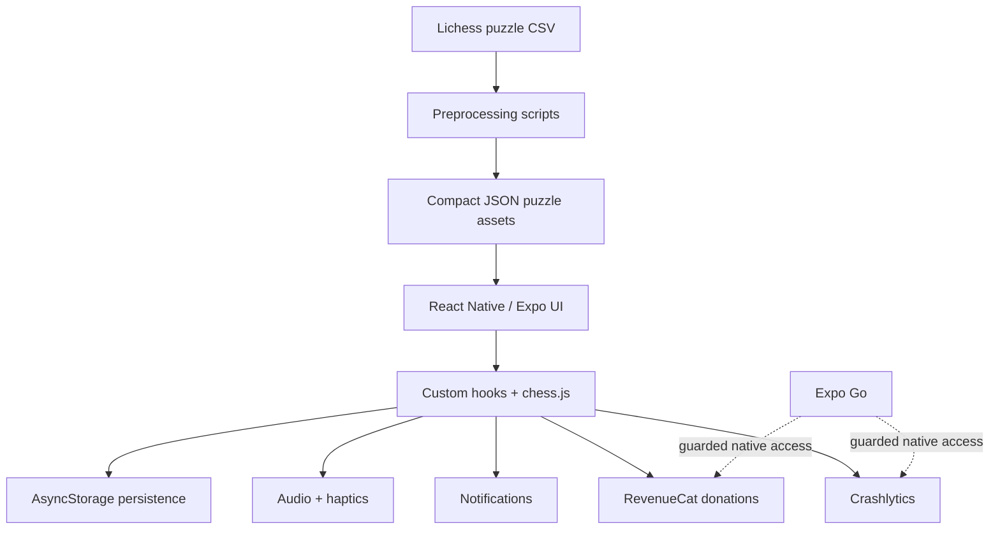

# PuzzleForge Code Showcase

> Curated public snippets from `PuzzleForge`, an offline-first mobile chess tactics trainer built with Expo React Native.

## Why this repository exists

The production PuzzleForge application is private because it is a personal commercial project. This public repository contains selected code samples that show how I structure React Native features, preprocessing pipelines, and client-side persistence without exposing the full product, sensitive configuration, or monetization internals.

## What PuzzleForge does

- Offline-first chess tactics training for mobile
- Multiple training modes including Endless, Missed Puzzles, and Woodpecker
- Local progress persistence for continuity across sessions
- Mobile-first UX with custom board feedback, filtering, audio, haptics, and localization
- Optional native services such as donations, notifications, and crash reporting

## Included snippets

| File | Focus |
| --- | --- |
| `snippets/data/puzzle-pipeline.js` | Streaming CSV preprocessing, filtering, and reservoir sampling |
| `snippets/mobile/puzzle-board-check-overlay.js` | Custom board theming and FEN-driven check visualization |
| `snippets/mobile/filter-drawer.js` | Localized theme filtering with draft-vs-apply interaction |
| `snippets/mobile/use-feedback-effects.js` | Audio and haptics orchestration in a React hook |
| `snippets/storage/woodpecker-results.js` | AsyncStorage persistence and deterministic best-run calculation |

## Architecture notes

- Runtime gameplay is local-first and does not require a backend.
- Chess validation and board progression are driven on-device.
- Puzzle data is prepared during development, then shipped as compact JSON assets.
- Native-only services are guarded so Expo Go can still be used safely for rapid UI iteration.

## Portfolio framing

Recruiters and reviewers can use this repo to evaluate:

- Code organization and naming
- React Native component and hook design
- Offline mobile architecture decisions
- Client persistence patterns
- Data preparation and transformation logic
- UX-focused engineering tradeoffs

## Notes

- These snippets are adapted from the private PuzzleForge codebase.
- They are intentionally curated and are not meant to run standalone.
- Secrets, account identifiers, and production service configuration are excluded.
